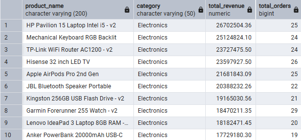
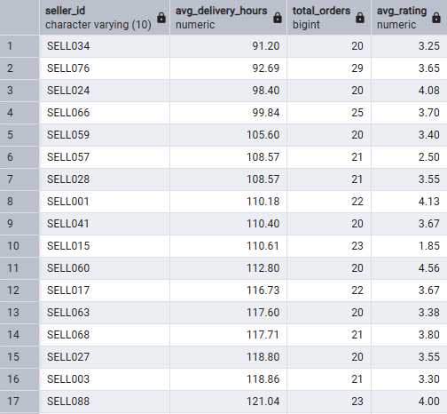
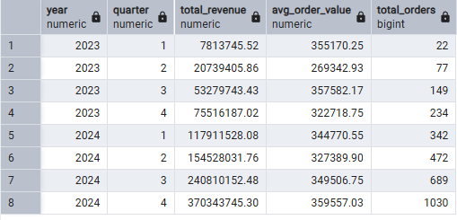
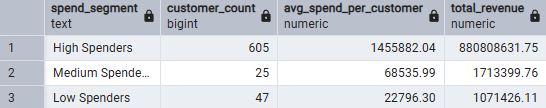
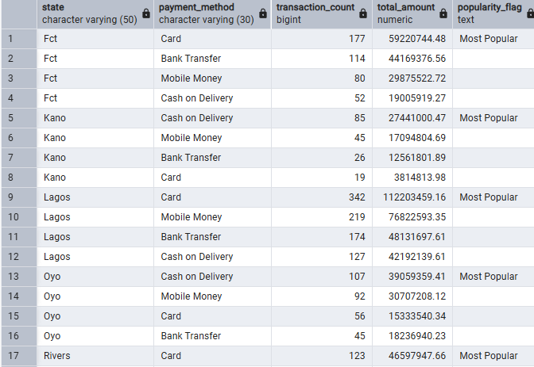
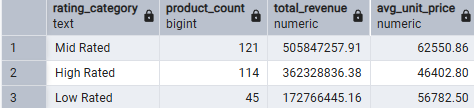
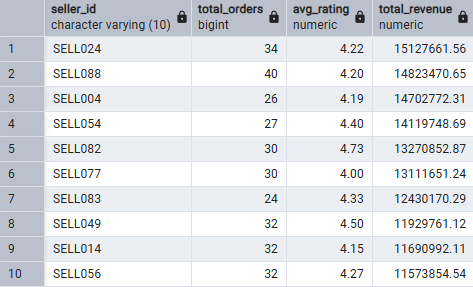

# TradeZone E-commerce Business Analysis

## Project Overview

TradeZone is a fast-growing Nigerian e-commerce platform connecting buyers
and sellers across Lagos, Abuja, Kano, Port Harcourt and Ibadan.

This project analyzes TradeZone's 2023–2024 data using PostgreSQL to uncover
insights around customer acquisition, product performance, seller fulfilment,
revenue trends, customer spending, payment preferences and seller performance.

The goal was to turn raw business data into actionable insights that can
support business decisions for the 2025 planning cycle.

## Business Questions

The analysis answers eight key business questions:

1. Customer Acquisition & 30-Day Conversion
2. Product Performance
3. Seller Fulfilment Efficiency
4. Quarterly Revenue Trends
5. Customer Spend Segmentation
6. Payment Method Preferences by State
7. Review Ratings & Sales Performance
8. Top Seller Bonus Qualification

## Tools Used

- PostgreSQL
- SQL
- Git & GitHub

### SQL Skills

- Data Cleaning
- Data Validation
- JOINs
- Aggregate Functions
- GROUP BY
- HAVING
- CASE Statements
- Date Functions
- Subqueries

## Data Cleaning

The dataset was cleaned and validated before analysis.

Key activities included:

- Handling missing values
- Checking duplicate records
- Standardizing city names
- Normalizing product categories
- Validating dates
- Validating order totals against order items
- Checking review for invalid ratings
- Removing null amount from payments because financial data must be valid
- Replacing missing line total using quantity * unit price

## SQL Analysis & Key Business Insights 

### Q1 — Customer Acquisition & 30-Day Conversion
Lagos led the top five (5) states in both **total_signups (146)** & **converted_customers (72%)** which indicates a strong customer acquisition and early purchase engagement in the TradeZone market.

### Q2 — Product Performance
Revenue is fairly evenly distributed across the top 10 SKUs (~$18M–$27M) with no single dominant outlier, and order volume clusters tightly (19–29 orders) led by HP Pavillion 15 laptop Intel i5-V2 in the Electronics category. 

### Q3 — Seller Fulfilment Efficiency
SELL034 is the fastest overall, and interestingly it also has one of the lower ratings (3.25) in that range. It's worth noting that speed alone isn't fully driving rating, since SELL066 (99.84 hrs) rates higher at 3.70 despite being slower.

### Q4 — Quarterly Revenue Trends
2023 total revenue was ~$157.3M across 482 orders, while 2024 jumped to ~$883.6M across 2,533 orders, roughly a 5.6x revenue increase and 5.3x order volume increase year-over-year. Average order value stayed relatively stable (mid-$300s throughout both years, dipping slightly in Q2 2024 before recovering in Q4).

### Q5 — Customer Spend Segmentation
High Spenders (605 customers, avg ₦1,455,882) generate 99.4% of total revenue (~₦881M out of ~₦884M combined), while Medium (25 customers) and Low Spenders (47 customers) contribute negligibly despite still being active accounts.

### Q6 — Payment Method Preferences by State
Card dominates in more urbanized, higher-transaction-volume states (Lagos, Fct), while Cash on Delivery persists in Kano and Oyo, likely reflecting lower digital payment penetration or trust in those regions.

### Q7 — Review Ratings & Sales Performance
Mid Rated products (3.0–3.99) generate the most total revenue ($505.8M) despite being priced highest on average ($62,550.86), while High Rated products (≥4.0) are priced lowest ($46,402.80) yet still pull in strong revenue from a similar product count.

### Q8 — Top Seller Bonus Qualification
These sellers show that high revenue doesn't require the most orders or the highest rating SELL082 has one of the few orders (30) and highest rating (4.73) yet still ranks 5th, while SELL088 relies on higher volume (40 orders) with a slightly lower rating to reach similar revenue

# Business Recommendations

### Improve early customer conversion
The Growth Team will roll out targeted onboarding campaigns (first-purchase discounts, reminders, personalized recommendations) within 30 days of signup, prioritizing lower-converting states like Kano and Oyo, with a goal of lifting 30-day conversion rate by 10+ percentage points in those states within 60-90 days.

**Responsible Team:** Growth Team

**Expected Outcome:** A 10+ percentage point increase in 30-day conversion rate in priority states like Kano (31% → 41%+) and Oyo, with a smaller 5-8 point lift platform-wide, translating directly into more paying customers and higher revenue without added acquisition spend.

### Reward Fast sellers
Introduce a Seller Performance Program, that rewards sellers with delivery times under 100 hours and ratings above 4.0 with bonuses, higher commission tiers, or increased visibility, while giving underperforming sellers clear feedback on how they compare.

**Responsible Team:** Seller Operations Team

**Expected Outcome:** Lower platform-wide average delivery time and higher average customer ratings, leading to improved user experience and increased repeat purchase rate.
