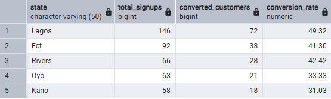

# TradeZone E-commerce Business Analysis

## Project Overview

TradeZone is a fast-growing Nigerian e-commerce platform connecting buyers
and sellers across Lagos, Abuja, Kano, Port Harcourt and Ibadan.

This project analyzes TradeZone's 2023–2024 data using PostgreSQL to uncover
insights around customer acquisition, product performance, seller fulfilment,
revenue trends, customer spending, payment preferences and seller performance.

The goal was to turn raw business data into actionable insights that can
support business decisions for the 2025 planning cycle.

---

## Business Questions

The analysis answers eight key business questions:

1. Customer Acquisition & 30-Day Conversion
2. Product Performance
3. Seller Fulfilment Efficiency
4. Quarterly Revenue Trends
5. Customer Spend Segmentation
6. Payment Method Preferences by State
7. Review Ratings & Sales Performance
8. Top Seller Bonus Qualification

---

## Tools Used

- PostgreSQL
- SQL
- Git & GitHub

### SQL Skills

- Data Cleaning
- Data Validation
- JOINs
- Aggregate Functions
- GROUP BY
- HAVING
- CASE Statements
- Date Functions
- Subqueries

---

## Data Cleaning

The dataset was cleaned and validated before analysis.

Key activities included:

- Handling missing values
- Checking duplicate records
- Standardizing city names
- Normalizing product categories
- Validating dates
- Validating order totals against order items
- Checking review for invalid ratings
- Removing null amount from payments because financial data must be valid
- Replacing missing line total using quantity * unit price

---

# SQL Analysis & Results

## Q1 — Customer Acquisition & 30-Day Conversion

Lagos led the top five (5) states in both **total_signups (146)** & **converted_customers (72%)** which indicates a strong customer acquisition and early purchase engagement in the TradeZone market.

---

## Q2 — Product Performance

**Business Question:**  
What are the top 10 products by revenue in 2024?

### Result

**[PLACE: Insert your Q2 result table/screenshot here.]**

---

## Q3 — Seller Fulfilment Efficiency

**Business Question:**  
Which sellers have the fastest average fulfilment times among sellers with
at least 20 completed orders?

### Result

**[PLACE: Insert your Q3 result table/screenshot here.]**

---

## Q4 — Quarterly Revenue Trends

**Business Question:**  
How did quarterly revenue, average order value and order volume compare
between 2023 and 2024?

### Result

**[PLACE: Insert your Q4 result table/screenshot here.]**

---

## Q5 — Customer Spend Segmentation

Customers were classified as:

- High Spenders: ≥ ₦100,000
- Medium Spenders: ₦50,000–₦99,999
- Low Spenders: < ₦50,000

### Result

**[PLACE: Insert your Q5 result table/screenshot here.]**

---

## Q6 — Payment Method Preferences by State

**Business Question:**  
Which payment methods are most popular across each state?

### Result

**[PLACE: Insert your Q6 result table/screenshot here.]**

---

## Q7 — Review Ratings & Sales Performance

Products were grouped into:

- High Rated: ≥ 4.0
- Mid Rated: 3.0–3.99
- Low Rated: < 3.0

### Result

**[PLACE: Insert your Q7 result table/screenshot here.]**

---

## Q8 — Top Seller Bonus Qualification

**Business Question:**  
Which sellers qualified for the top 10 based on revenue, order volume and
customer rating?

### Result

**[PLACE: Insert your Q8 result table/screenshot here.]**

---

# Key Business Insights

### 1. Customer Acquisition & Conversion

**[PLACE: State the most important finding from Q1, including the exact
number/percentage and what it means for TradeZone.]**

### 2. Revenue & Customer/Product Performance

**[PLACE: Combine the most important findings from Q2, Q4 and/or Q5.
Include exact figures and explain what they mean for the business.]**

### 3. Seller & Product Performance

**[PLACE: Use Q3, Q7 and/or Q8 to explain the most important finding about
seller fulfilment, ratings or sales performance.]**

---

# Business Recommendations

### Recommendation 1 — Customer Growth

**[PLACE: State the specific action TradeZone should take based on your
findings.]**

**Responsible Team:** [PLACE: Growth Team]

**Expected Outcome:** [PLACE: Expected result within 60–90 days.]

### Recommendation 2 — Seller Operations

**[PLACE: State the specific action TradeZone should take based on your
seller-performance findings.]**

**Responsible Team:** [PLACE: Seller Operations]

**Expected Outcome:** [PLACE: Expected result within 60–90 days.]

---
